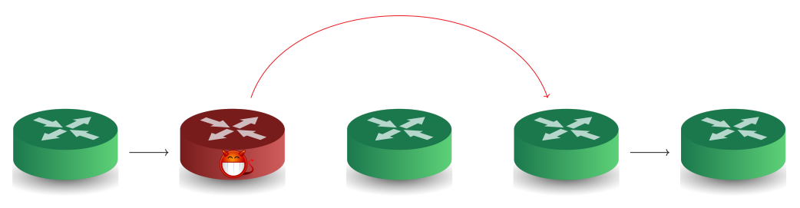
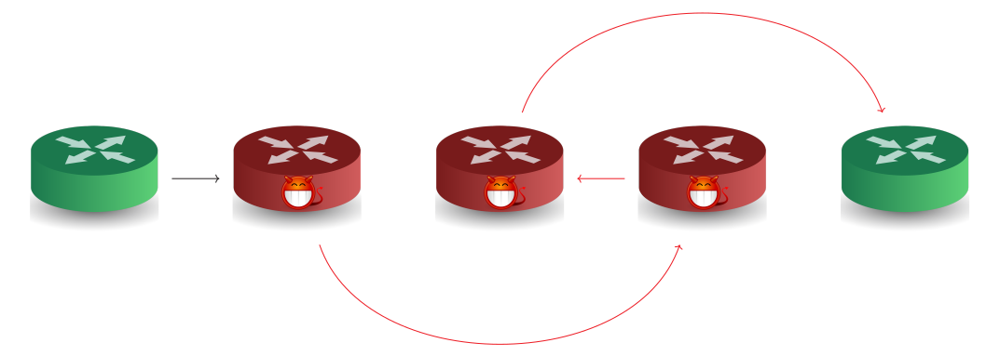
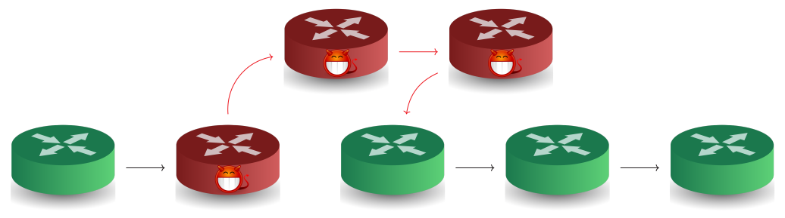
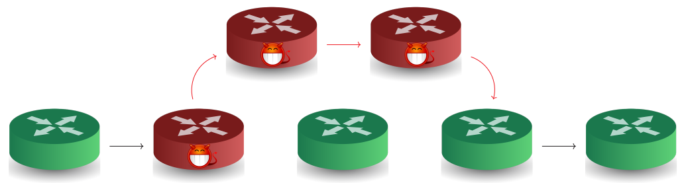
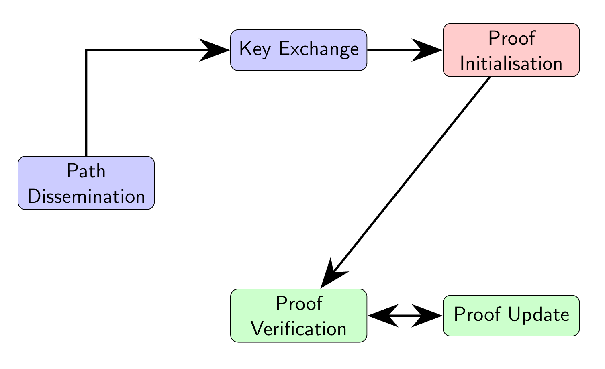

# Network Path Validation for Packets Deliver

### Dorine CHAGNON

Université Clermont Auvergne, CNRS, Mines Saint-Etienne, LIMOS, France\
dorine.chagnon@doctorant.uca.fr\
May 10-12, RESSI 2023

- - -

## Context for Path Validation

* Skipping attack

* Out-of-order attack

* Addition attack

* Detour attack

- - -

## Steps of Path Validation

- - -

## State-of-the-art

* ICING (2011)
* OPT (2014)
* OSV (2016)
* PPV (2018)
* Atomos (2019)
* PrivNPV (2020)
* EPIC (2020)

### Go see my poster to know more about\
Path Validation.

Dorine CHAGNON\
dorine.chagnon@doctorant.uca.fr\
May 10–12, RESSI 202